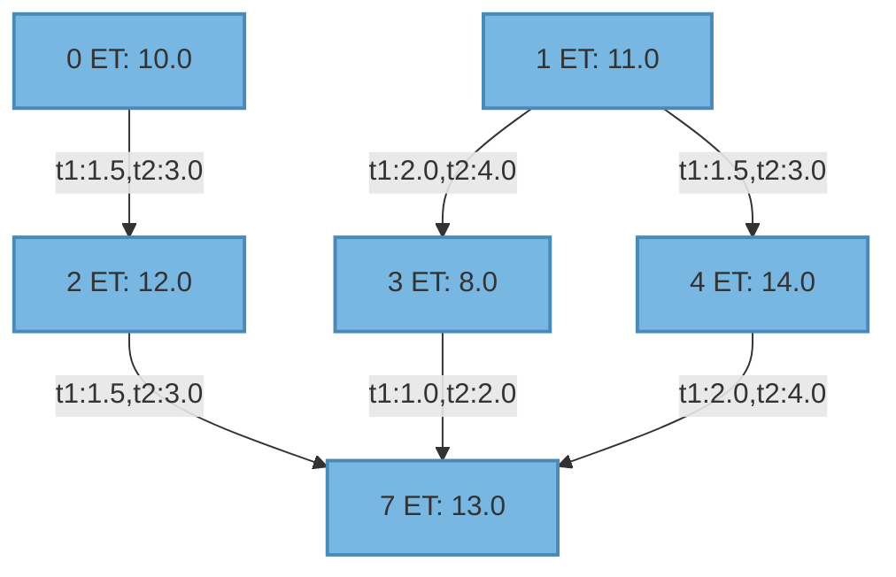
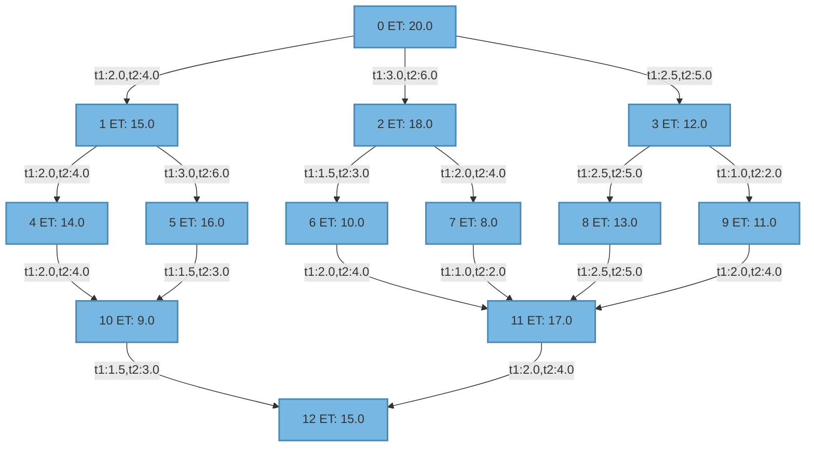

Diagram for dag 1

```mermaid
graph TD
    0["0 ET: 10.0"]
    1["1 ET: 11.0"]
    2["2 ET: 12.0"]
    3["3 ET: 8.0"]
    4["4 ET: 14.0"]
    5["7 ET: 13.0"]

    0 -->|t1:1.5,t2:3.0| 2

    1 -->|t1:2.0,t2:4.0| 3
    1 -->|t1:1.5,t2:3.0| 4

    2 -->|t1:1.5,t2:3.0| 5
    3 -->|t1:1.0,t2:2.0| 5
    4 -->|t1:2.0,t2:4.0| 5

    classDef default fill:#78B7E2,stroke:#4a8ab8,stroke-width:2px;

```

Diagram for dag 2

```mermaid
graph TD
    0["0 ET: 20.0"]
    1["1 ET: 15.0"]
    2["2 ET: 18.0"]
    3["3 ET: 12.0"]
    4["4 ET: 14.0"]
    5["5 ET: 16.0"]
    6["6 ET: 10.0"]
    7["7 ET: 8.0"]
    8["8 ET: 13.0"]
    9["9 ET: 11.0"]
    10["10 ET: 9.0"]
    11["11 ET: 17.0"]
    12["12 ET: 15.0"]

    0 -->|t1:2.0,t2:4.0| 1
    0 -->|t1:3.0,t2:6.0| 2
    0 -->|t1:2.5,t2:5.0| 3

    1 -->|t1:2.0,t2:4.0| 4
    1 -->|t1:3.0,t2:6.0| 5

    2 -->|t1:1.5,t2:3.0| 6
    2 -->|t1:2.0,t2:4.0| 7

    3 -->|t1:2.5,t2:5.0| 8
    3 -->|t1:1.0,t2:2.0| 9

    4 -->|t1:2.0,t2:4.0| 10
    5 -->|t1:1.5,t2:3.0| 10

    6 -->|t1:2.0,t2:4.0| 11
    7 -->|t1:1.0,t2:2.0| 11
    8 -->|t1:2.5,t2:5.0| 11
    9 -->|t1:2.0,t2:4.0| 11

    10 -->|t1:1.5,t2:3.0| 12
    11 -->|t1:2.0,t2:4.0| 12

    classDef default fill:#78B7E2,stroke:#4a8ab8,stroke-width:2px;

```