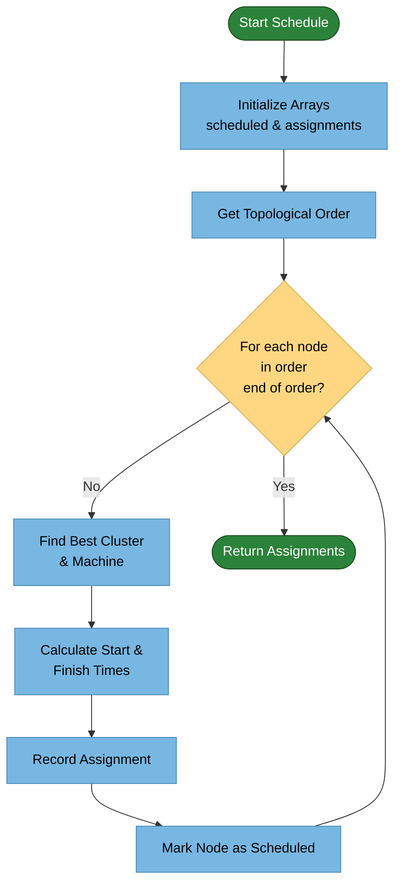
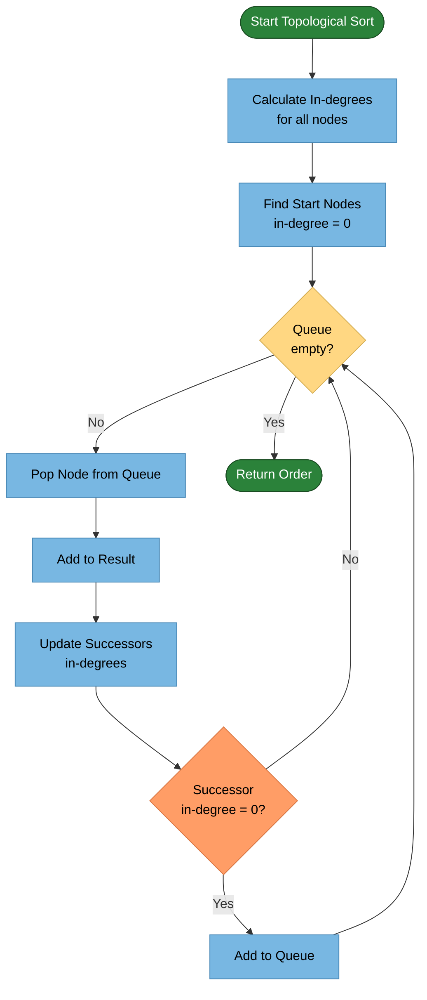
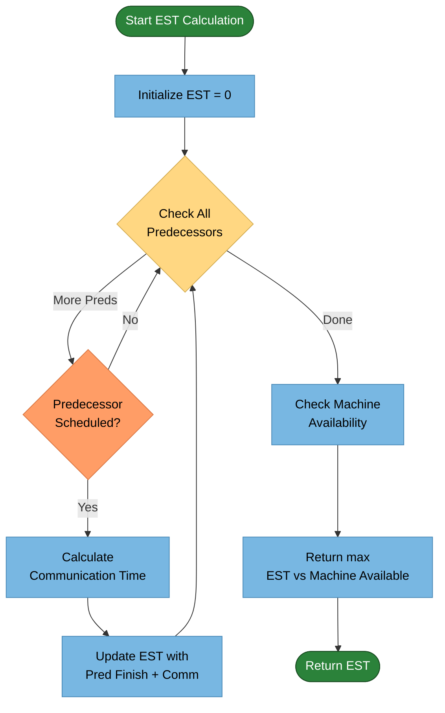
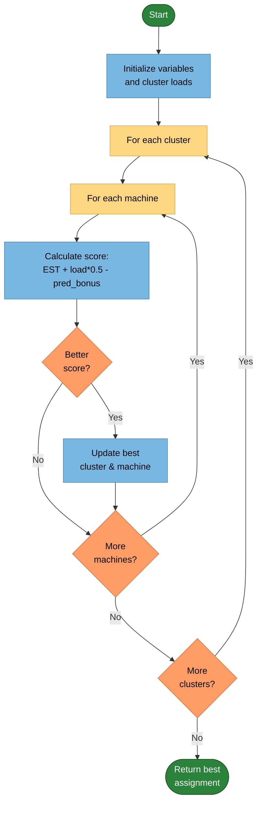

```mermaid
flowchart TB
    classDef start fill:#2B823A,stroke:#1a4c22,color:white
    classDef process fill:#78B7E2,stroke:#4a8ab8,color:black
    classDef decision fill:#FF9D66,stroke:#d97642,color:black
    classDef loop fill:#FFD782,stroke:#d4ad52,color:black

    Start([Start Schedule]):::start --> Init[Initialize Arrays<br>scheduled & assignments]:::process
    Init --> GetTopo[Get Topological Order]:::process
    GetTopo --> LoopStart{For each node<br>in order<br> end of order?}:::loop
    LoopStart --> |No| FindMachine[Find Best Cluster<br>& Machine]:::process
    FindMachine --> CalcTimes[Calculate Start &<br>Finish Times]:::process
    CalcTimes --> Record[Record Assignment]:::process
    Record --> MarkScheduled[Mark Node as Scheduled]:::process
    MarkScheduled --> LoopStart
    LoopStart --> |Yes| ReturnAssign([Return Assignments]):::start
```
---

```mermaid
flowchart TB
    classDef start fill:#2B823A,stroke:#1a4c22,color:white
    classDef process fill:#78B7E2,stroke:#4a8ab8,color:black
    classDef decision fill:#FF9D66,stroke:#d97642,color:black
    classDef loop fill:#FFD782,stroke:#d4ad52,color:black

    Start([Start Topological Sort]):::start --> CalcDegree[Calculate In-degrees<br>for all nodes]:::process
    CalcDegree --> FindStart[Find Start Nodes<br>in-degree = 0]:::process
    FindStart --> ProcessLoop{Queue<br>empty?}:::loop
    ProcessLoop --> |No| PopNode[Pop Node from Queue]:::process
    PopNode --> AddResult[Add to Result]:::process
    AddResult --> UpdateSucc[Update Successors<br>in-degrees]:::process
    UpdateSucc --> CheckSucc{Successor<br>in-degree = 0?}:::decision
    CheckSucc --> |Yes| AddQueue[Add to Queue]:::process
    AddQueue --> ProcessLoop
    CheckSucc --> |No| ProcessLoop
    ProcessLoop --> |Yes| ReturnOrder([Return Order]):::start
```
---

```mermaid
flowchart TB
    classDef start fill:#2B823A,stroke:#1a4c22,color:white
    classDef process fill:#78B7E2,stroke:#4a8ab8,color:black
    classDef decision fill:#FF9D66,stroke:#d97642,color:black
    classDef loop fill:#FFD782,stroke:#d4ad52,color:black

    Start([Start EST Calculation]):::start --> InitEST[Initialize EST = 0]:::process
    InitEST --> CheckPred{Check All<br>Predecessors}:::loop
    CheckPred --> |More Preds| IsScheduled{Predecessor<br>Scheduled?}:::decision
    CheckPred --> |Done| CheckMachine[Check Machine<br>Availability]:::process
    IsScheduled --> |Yes| CalcComm[Calculate<br>Communication Time]:::process
    CalcComm --> UpdateEST[Update EST with<br>Pred Finish + Comm]:::process
    UpdateEST --> CheckPred
    IsScheduled --> |No| CheckPred
    CheckMachine --> FinalEST[Return max<br>EST vs Machine Available]:::process
    FinalEST --> End([Return EST]):::start
```

---

```mermaid
%% algorithm 4 detail - simplified

flowchart TD
    classDef start fill:#2B823A,stroke:#1a4c22,color:white
    classDef process fill:#78B7E2,stroke:#4a8ab8,color:black
    classDef decision fill:#FF9D66,stroke:#d97642,color:black
    classDef loop fill:#FFD782,stroke:#d4ad52,color:black
    classDef component fill:#E8C1FF,stroke:#c094e2,color:black

    Start([Start]):::start --> InitVars[Initialize variables<br>and cluster loads]:::process

    InitVars --> ClusterLoop[For each cluster]:::loop
    ClusterLoop --> MachineLoop[For each machine]:::loop

    MachineLoop --> CalcScore[Calculate score:<br>EST + load*0.5 - pred_bonus]:::process

    CalcScore --> CheckBest{Better<br>score?}:::decision
    CheckBest -->|Yes| UpdateBest[Update best<br>cluster & machine]:::process
    CheckBest -->|No| Continue{More<br>machines?}:::decision
    UpdateBest --> Continue

    Continue -->|Yes| MachineLoop
    Continue -->|No| NextCluster{More<br>clusters?}:::decision
    NextCluster -->|Yes| ClusterLoop
    NextCluster -->|No| Return([Return best<br>assignment]):::start
```